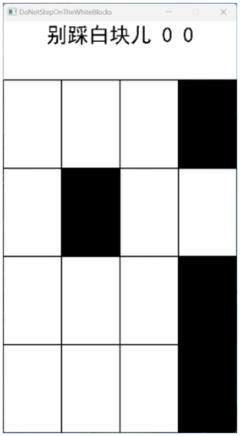

# MyLittleGames
学习游戏相关课程时制作的小游戏

使用visual studio c++制作的小项目

## 目录
- [MyLittleGames](#MyLittleGames)
  - [目录](#目录)
  - [游戏列表](#游戏列表)
  - [](#)
  - [](#)

## 游戏列表
- [1.别踩白块儿](#别踩白块儿)
- [2.](#)
- [3.](#)
- [4.](#)
- [5.](#)

## 别踩白块儿
通过easyx图形库制作的简易小游戏

```
#include<easyx.h>
```



- [功能实现]
   - [计分]
   - [游玩时间记录（秒）]
   - [黑块的下移与随机位置]
   - [点到非最后一排黑块游戏结束]
